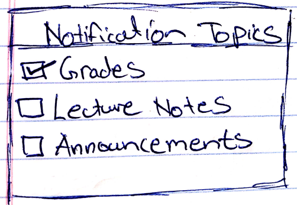

# Lab 04

## Analysis of Brightspace
I think one thing that I have really wanted to do but is not present in Brightspace right now is a way to filter the notification service such that I only receive notifications about topics that I have selected or “subscribed” to. An example of this would be me subscribing to get notifications about grades when they are released by the professors and unsubscribing from notifications about course lecture slides that have been recently uploaded by the professor.

To solve this issue, a simple checklist can be implemented within the notification settings that allows students to check/select topics on the checklist about which topics they wish to receive notifications of. This would largely help students who have a full course load and struggle to differentiate between important notifications and lower priority notifications mainly due the large number of notifications.

